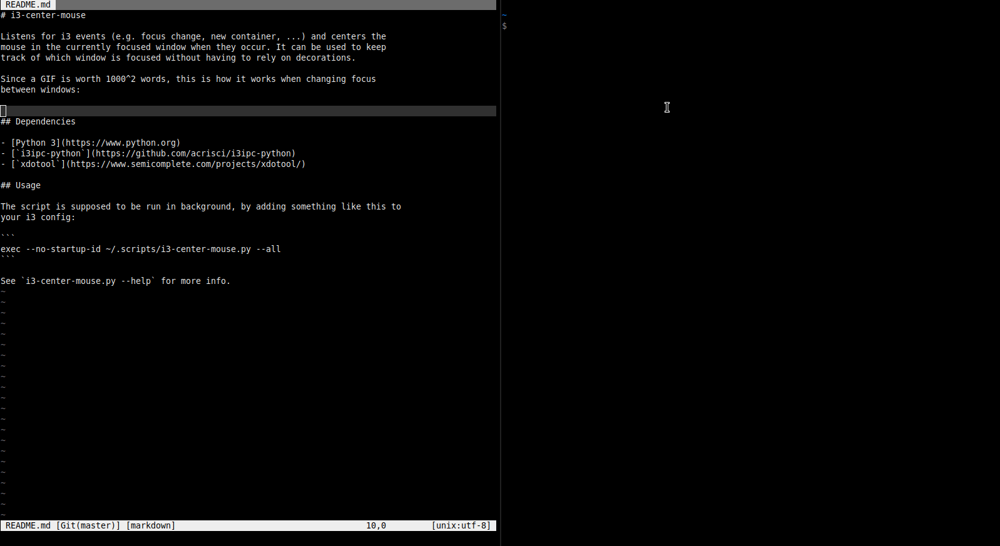

# i3-center-mouse

Listens for i3 events (e.g. `focus`, `exec`, `workspace`, ...) and centers the
mouse in the currently focused window when they occur. It can be used to keep
track of which window is focused without having to rely on decorations.

Since a GIF is worth 1000^2 words, this is how it works when changing focus
between windows:



## Dependencies

- [Python 3](https://www.python.org) (`sudo apt install
  python3` on Ubuntu / Debian based systems)
- [`i3ipc-python`](https://github.com/acrisci/i3ipc-python) (`pip3 install
  i3ipc`, after installing `pip`)
- [`xdotool`](https://www.semicomplete.com/projects/xdotool/) (`sudo apt install
  xdotool` on Ubuntu / Debian based systems)

## Usage

The script is supposed to be run in background, by adding something like this to
your i3 config:

```
exec --no-startup-id ~/.scripts/i3-center-mouse.py --all
```

See `i3-center-mouse.py --help` for more info.
